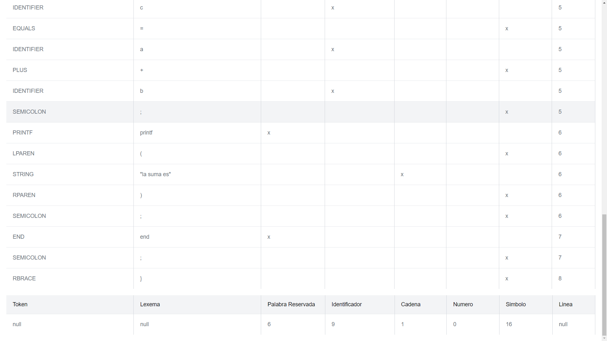
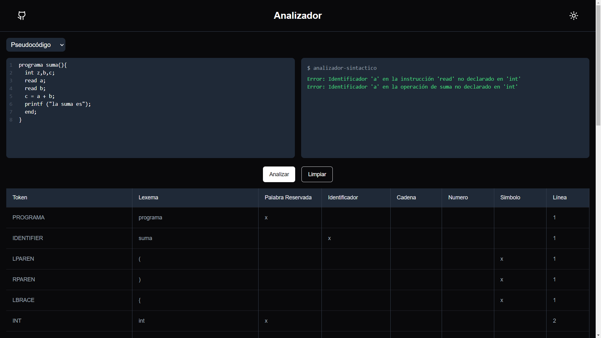

# Analizador Sintáctico

Este proyecto es un analizador sintáctico que utiliza Next.js para el frontend y un backend en Flask. El propósito del proyecto es analizar sintácticamente y lexicamente el código proporcionado por el usuario.

### Enlace a la Aplicación Desplegada
[analizador-sintactico-bcol.vercel.app](https://analizador-sintactico-bcol.vercel.app)

## Tabla de Contenidos

- [Analizador Sintáctico](#analizador-sintáctico)
    - [Enlace a la Aplicación Desplegada](#enlace-a-la-aplicación-desplegada)
  - [Tabla de Contenidos](#tabla-de-contenidos)
  - [Advertencia](#advertencia)
  - [Instalación](#instalación)
  - [Uso](#uso)
  - [Configuración](#configuración)
  - [Código de Prueba](#código-de-prueba)
  - [Capturas de Pantalla](#capturas-de-pantalla)
  - [Licencia](#licencia)

## Advertencia
> [!WARNING]  
> Si ingresas a la versión desplegada, puede que el servidor backend este suspendido o este lento. En ese caso, intenta recargar varias veces la página o espera unos minutos antes de volver a intentarlo.


## Instalación

Sigue estos pasos para configurar el proyecto localmente:

1. Clona el repositorio:
    ```bash
    git clone https://github.com/FdevMX/Analizador-Sintactico.git
    ```
2. Navega al directorio del proyecto:
    ```bash
    cd analizador-sintactico
    ```
3. Instala las dependencias del frontend:
    ```bash
    cd frontend
    npm install
    ```
4. Instala las dependencias del backend, recuerda crear tu entorno virtual antes de esto:
    ```bash
    cd ../backend
    pip install -r requirements.txt
    ```

## Uso

Para ejecutar el proyecto localmente:

1. Inicia el backend (asumiendo que Flask está configurado para ejecutarse en el puerto 5000):
    ```bash
    cd backend
    flask run
    ```
2. Inicia el frontend:
    ```bash
    cd ../frontend
    npm run dev
    ```

## Configuración

El archivo de configuración principal para el frontend es `next.config.mjs`. Aquí puedes ajustar las siguientes opciones:

- `reactStrictMode`: Activa el modo estricto de React.
- `rewrites`: Configura las rutas de reescritura para el backend.
- Asegúrate de comentar la opción `destination` que se ejecuta por servidor y descomentar la URL por localhost para que funcione correctamente.

Ejemplo de configuración en el archivo `next.config.mjs`:
```javascript
/** @type {import('next').NextConfig} */
const nextConfig = {
    reactStrictMode: true,
    async rewrites() {
      return [
        {
          source: '/analyze',
          destination: 'http://localhost:5000/analyze',
        },
      ]
    },
}
  
export default nextConfig;
```

## Código de Prueba

Puedes usar el siguiente código para probar el analizador:

```java
for (int i = 1; i <= 5; i+) { 
    System.out.println("El valor de la cifra es: " + i);
}
```

Debe darte un mensaje de error como el siguiente:

```
Error en la línea 1: Incremento incorrecto, use '++' en lugar de '+'
```

## Capturas de Pantalla

Aquí hay algunas capturas de pantalla del proyecto en funcionamiento:

<table>
  <tr>
    <td></td>
    <td></td>
    <td></td>
  </tr>
  <tr>
    <td><em>Imagen 1: Codigo limpio sin errores</em></td>
    <td><em>Imagen 2: Codigo con error de incremento</em></td>
    <td><em>Imagen 3: Codigo con error de incremento y de sintaxis</em></td>
  </tr>
  <tr>
    <td></td>
    <td></td>
    <td></td>
  </tr>
  <tr>
    <td><em>Imagen 4: Codigo con error de sintaxis: hay incremento inválido</em></td>
    <td><em>Imagen 5: Codigo con error de sintaxis: faltan llaves de cierre</em></td>
    <td><em>Imagen 6: Codigo con error de sintaxis: falta un punto y coma</em></td>
  </tr>
</table>


## Licencia

Este proyecto está licenciado bajo la Licencia MIT. Consulta el archivo LICENSE para más detalles.

[GPL-3.0 license](https://choosealicense.com/licenses/gpl-3.0/)

